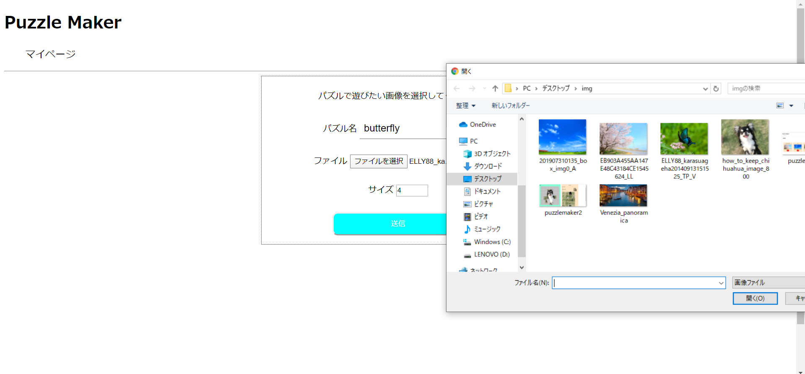
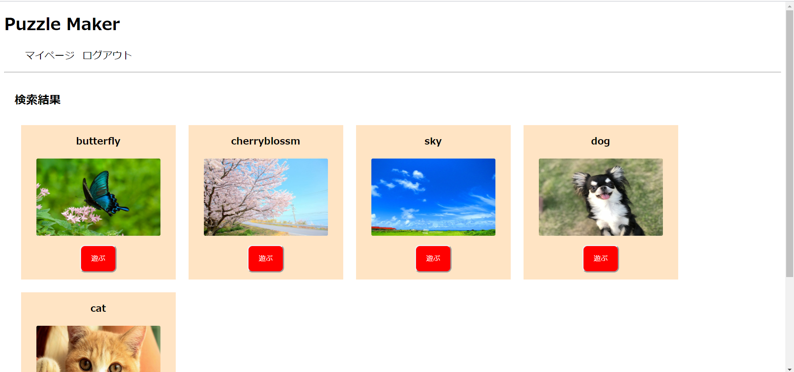

# makePuzzle
好きな画像をアップロードするとその画像のパズルゲームを作成するアプリです

# makePuzzle

## どんなアプリ？
### 好きな画像をアップロードするとその画像のパズルゲームを作成するアプリです　　
  

##  使い方
### １．好きな画像を用意します  
   
  
### ２．パズルを作成するボタンを押して設定を行います  
  

### ３．設定をアップすると一覧にパズルが追加されます   

### ４．あとは遊ぶ

## 　使用したライブラリ等
### ・Flask  
### ・Flask-login  
### ・sqlite  -> RealtimeDatabase
### ・Google Cloud Storage  
### ・OpenCV 
